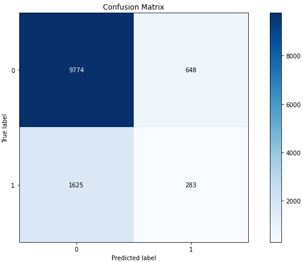

The importance of data analysis in companies has become crucial to improve sales and understand customers, to this has been added the power to have statistical information on our websites and with them improve the customer experience. In this project, I have analyzed through these data about the online purchase intention of people.

## Project Description

From a dataset that consists of statistical characteristics of about 12,000 sessions on online sales websites, I carried out an analysis of the purchase intention that a person could have in a virtual way and how we could predict the behavior of users. This [dataset](https://archive.ics.uci.edu/ml/datasets/Online+Shoppers+Purchasing+Intention+Dataset) was created and hosted in the UCI Machine Learning Repository.

### Data exploration
I start the data exploration reading the dataset, then I looked for missing values. Finally I took related bounce rates of customers.



### Machine Learning algorithms

Next I used K-elbow method to determine clusters



The number of optimal clustering groups for the duration of the product and the bounce rates is 2 as you can see in the next graph:

I applied the K Means method to find the clusters



Next I got predicted clustering result label and plotted the normalized and non-normalized confusion matrix for predictions



### Final analysis

From the confusion matrix, we can see that out of 10,422 failed incomes, 9,769 are grouped into uninterested customers or 94%. However, out of 937 successful incomes, only 284 are grouped as target customers or 15%. Also, the adjusted index score is not very high.

So it is clear that I have poorly bundled many successful revenue sessions as uninterested customers, which means when the high bounce rate combined with a short product-related page duration, there are still a lot of customers. 

Thanks for reading! 😄
