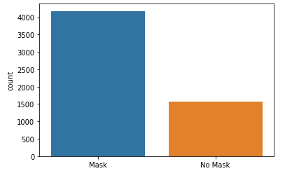
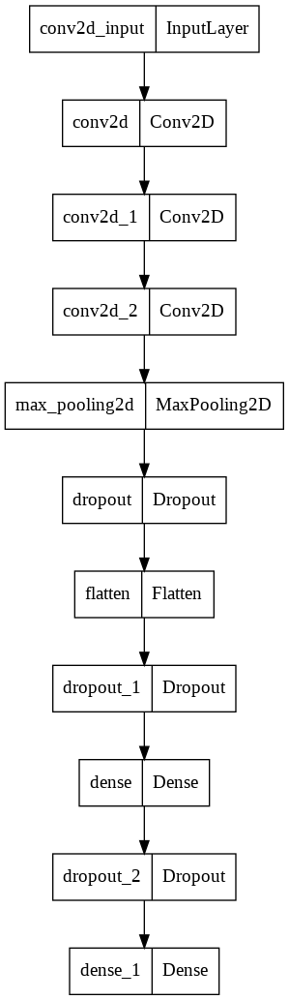
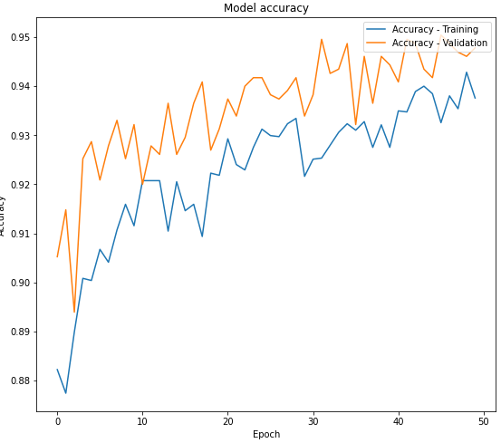
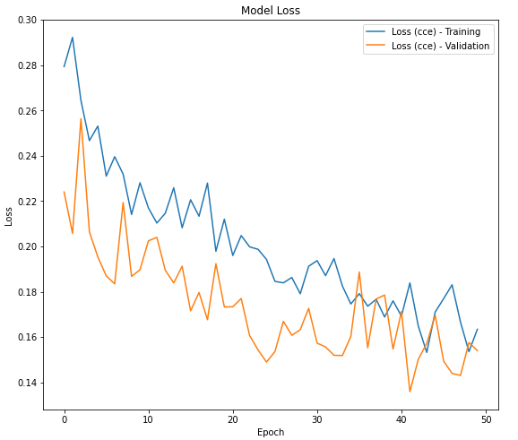

With the advances that neural networks have had lately and specifically convolutional neural networks, and the situation that the planet has been presenting; I have realized the importance of the field of computer vision to apply it to the specific detection of "something". In this case, that something is the mask, a vital element today, that detection could be very useful from now on.

## Project Description
Through the use of convolutional neural networks, I made a model that it's capable of detecting by reading an image if a person is wearing a face mask or not. The database I'm using contains about 6400 images of people. Each of these images also has a JSON type file that indicates many of its characteristics, being "class_name" the one that indicates the types of accessories that the people in the image are wearing (where we're going to classify if they're wearing a mask or not). The objective of this project is to apply CNN for a possible tool that uses computer vision and artificial intelligence to prevent infections in closed spaces.

### Data preprocessing
First I made a function for retrieve the JSON file containing the bounding box data in the training dataset, then I explored the JSON data provided for the training



I looked the amount of labeled data for each category



Next I created the input and output data of the model



### Model Creation
The model architecture is the following:

The model has 23M training parameters aprox and you can download it [here](https://drive.google.com/file/d/1oLV40ere7hftzJzp2v2hInLxv9cE90i0/view?usp=sharing). Finally, I obtained a model with 94.78% accuracy in prediction and with anerror of 0.1541.(https://github.com/yepedraza/mask-detection).

You can see detaily the codes and documentation in this [Repo]. Thanks for reading 😄
